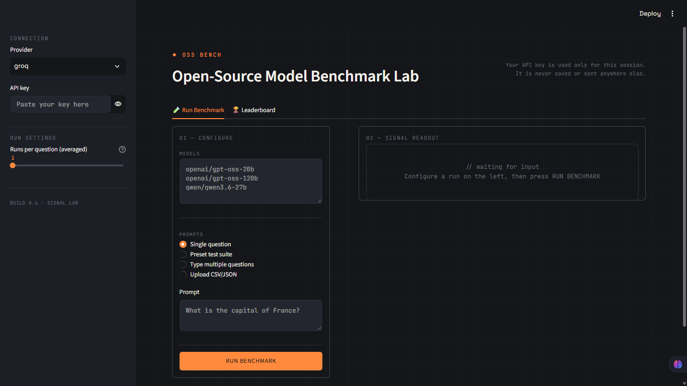

<div align="center">

# ◆ OSS Bench

**Open-Source Model Benchmark Lab**

Compare speed, cost, and token usage across any LLM provider — Groq, OpenAI, Anthropic, and more — from one interface.


</div>

---

## What is this?

**OSS Bench** is a benchmarking tool for large language models. Instead of guessing which model is fastest, cheapest, or most token-efficient for your use case, you run the same prompt(s) across multiple models side-by-side and get real numbers back.

It works with **any provider LangChain supports** (Groq, OpenAI, Anthropic, Google) — you bring your own API key and model names, nothing is hardcoded.

## Features

- 🔌 **Provider-agnostic** — type in any provider and any model name, no fixed list
- 🔑 **Bring your own key** — your API key is used only for your session, never stored or logged
- 🧪 **Single or batch testing** — one question, a typed list, a preset test suite (Math, Coding, Reasoning, Factual Q&A, Creative Writing), or upload your own CSV/JSON of questions
- ⏱️ **Speed metrics** — response time and tokens/second per model
- 💰 **Optional cost tracking** — enter $/1M token pricing yourself and get real cost-per-call numbers (no hardcoded, quickly-outdated pricing tables)
- 🔁 **Multi-run averaging** — run each question multiple times per model to smooth out network/server noise
- 🧠 **Reasoning-model aware** — automatically separates `<think>` reasoning blocks (e.g. Qwen) from the final answer, with an estimated token split
- 🏆 **Leaderboard** — every run is saved to history and aggregated into an all-time leaderboard with a speed chart
- 📤 **Exports** — download results as CSV or a formatted Markdown report
- 🖥️ **CLI + Web UI** — use it from the terminal (`main.py`) or a full Streamlit interface (`app.py`)

## Screenshot


```

```

## Tech stack

- **Python** + **uv** for dependency management
- **LangChain** (`init_chat_model`) for a provider-agnostic model interface
- **Streamlit** for the web UI
- Zero external database — history is stored locally in a simple JSON file

## Project structure

```
oss-bench/
├── app.py                # Streamlit web UI
├── main.py               # Command-line version
├── benchmark.py          # Core logic: calls a model, times it, gets tokens/cost
├── cost.py               # Cost calculation from user-supplied pricing
├── text_utils.py         # Splits <think> reasoning from final answers
├── suite_loader.py       # Parses uploaded CSV/JSON question files
├── history.py            # Saves runs + builds the leaderboard
├── report.py             # Builds the Markdown report export
├── get_user_input.py     # CLI input prompts
├── select_models.py      # (unused by current flow, kept for reference)
├── config.py             # Preset test suites + file names
├── .streamlit/
│   └── config.toml       # Theme config
├── pyproject.toml
├── .gitignore
└── README.md
```

## Getting started

### 1. Clone the repo
```bash
git clone https://github.com/YOUR_USERNAME/oss-bench.git
cd oss-bench
```

### 2. Install dependencies with uv
```bash
uv sync
```

### 3. Run the web app
```bash
uv run streamlit run app.py
```

### 4. Or run the CLI version
```bash
uv run main.py
```

You'll be prompted for a provider, an API key, model names, and a question — no `.env` file needed, since the app asks for everything at runtime.

## Getting an API key

- **Groq** (free tier available): [console.groq.com/keys](https://console.groq.com/keys)
- **OpenAI**: [platform.openai.com/api-keys](https://platform.openai.com/api-keys)
- **Anthropic**: [console.anthropic.com](https://console.anthropic.com)

## Known limitations

- Token count for reasoning vs. final answer (for models like Qwen) is an **estimate** based on text length, not an exact count — providers don't expose that split via the API.
- Cost figures depend entirely on pricing you enter yourself; leave it blank and cost simply won't be calculated for that model.
- History (`benchmark_history.json`) is stored on local disk — if deployed to a platform with ephemeral storage, it resets on redeploy or restart.

## Roadmap ideas

- Persistent history via a real database instead of a local JSON file
- Streaming responses with time-to-first-token measurement
- Automatic answer-correctness checking against expected answers
- Side-by-side diff view for comparing two models' answers

## License

MIT — free to use, modify, and share.